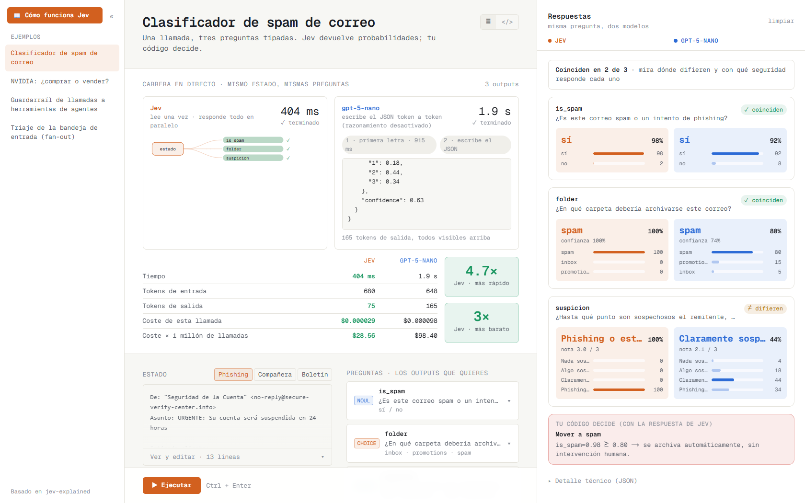
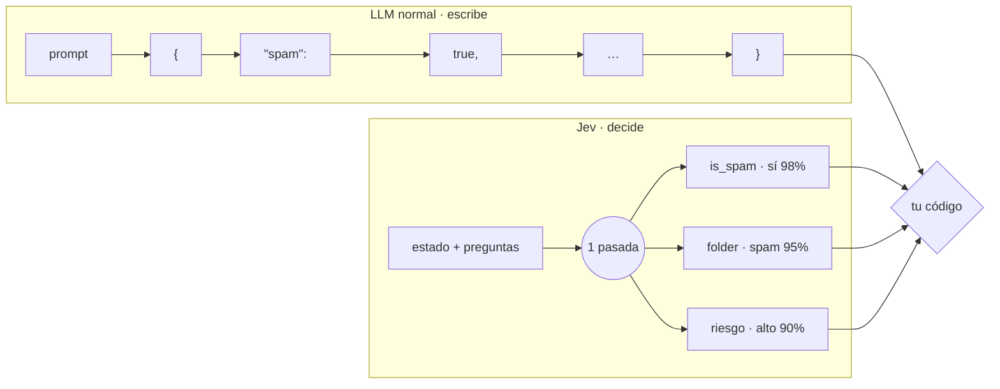
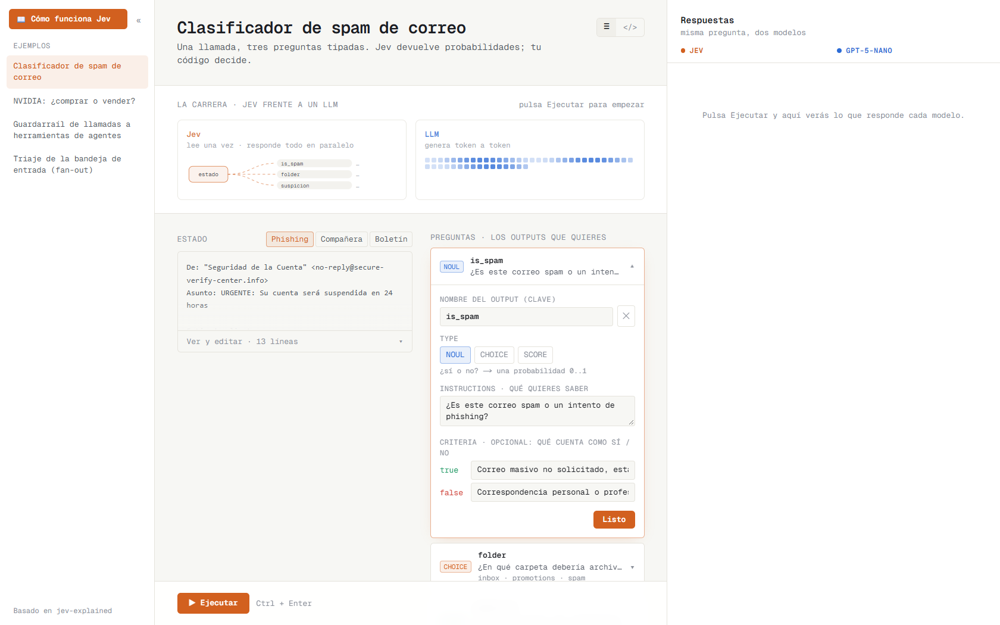
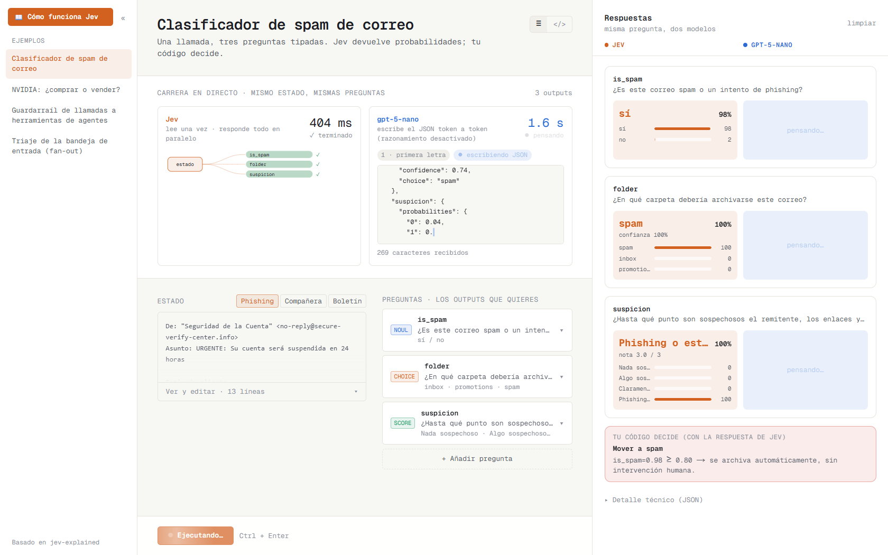
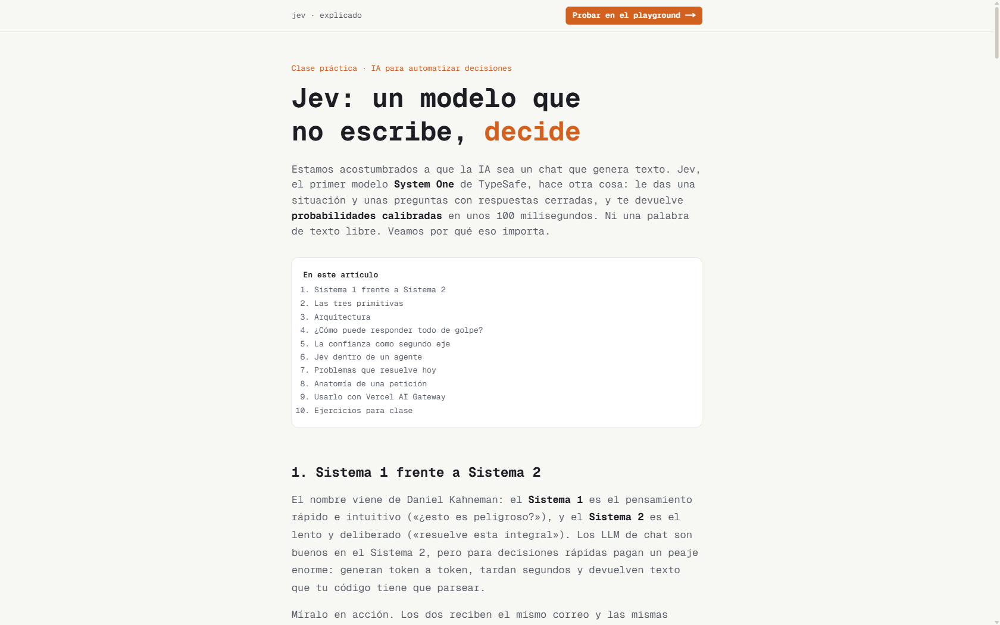
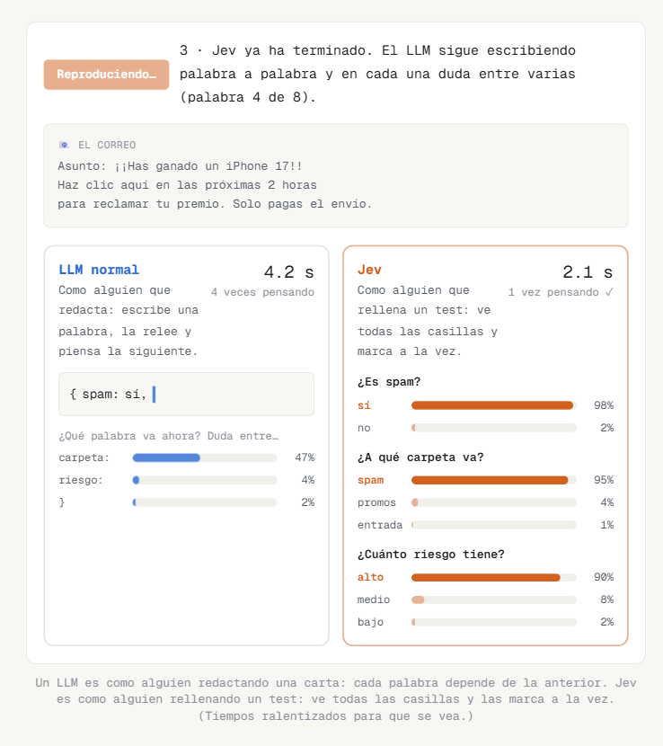
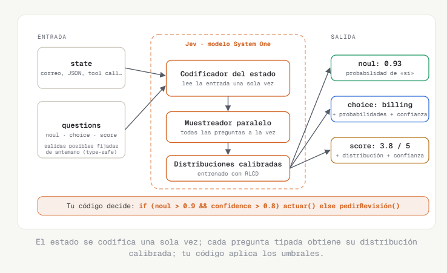
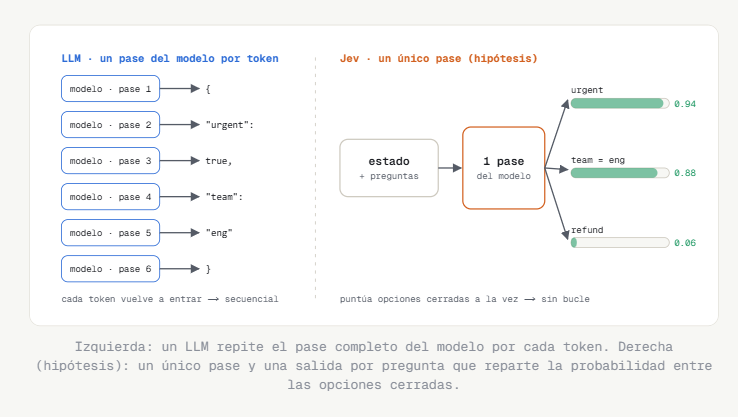
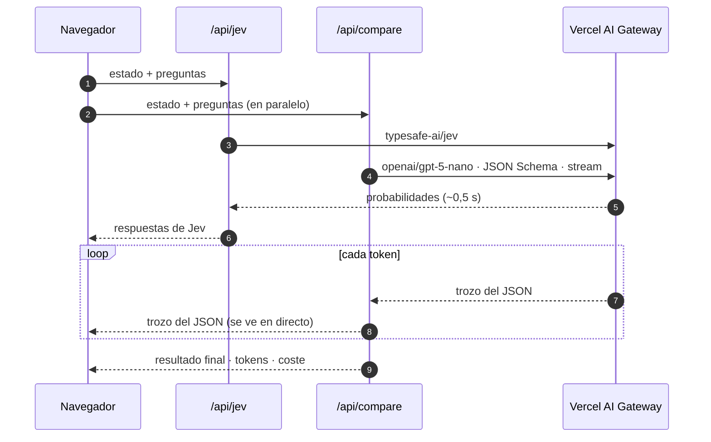

# Jev explicado

Playground y blog en español para entender **Jev**, el modelo System One de [TypeSafe](https://typesafe.ai/blog/introducing-system-one-models-and-jev), comparándolo en directo con un LLM normal (`gpt-5-nano`).



- **Playground (`/`)**: eliges un ejemplo, defines las preguntas y ves cómo responden los dos modelos: tiempo, tokens, coste y la respuesta de cada uno lado a lado.
- **Blog (`/blog`)**: explicación para no técnicos, con diagramas y animaciones.

---

## ¿Qué es Jev?

Un modelo que **no escribe texto: decide**. Le das una situación (`state`) y unas preguntas con respuestas cerradas (`questions`), y devuelve probabilidades calibradas para todas **a la vez, en una sola pasada**.



Un LLM construye la respuesta token a token: cada token necesita una pasada del modelo. Jev **puntúa las opciones que tú has definido**, todas en paralelo. Por eso diez preguntas cuestan casi lo mismo que una.

| Tipo | Pregunta | Devuelve |
| --- | --- | --- |
| `noul` | ¿sí o no? | una probabilidad de 0 a 1 |
| `choice` | ¿cuál de estas opciones? | la opción, la probabilidad de cada una y la confianza |
| `score` | ¿cuánto, en esta escala? | la nota, la probabilidad de cada nivel y la confianza |

---

## El playground

### 1. Elige un ejemplo y define tus preguntas

Cada pregunta es una tarjeta plegable. Al abrirla cambias su nombre, su tipo, sus instrucciones y sus `criteria`; los campos se adaptan al tipo elegido.



### 2. Pulsa Ejecutar y mira la carrera

Jev termina casi al instante. GPT escribe su JSON **en directo** (streaming real, no simulado).



### 3. Compara respuestas, tiempos y costes

Una tarjeta por pregunta, con Jev a la izquierda, GPT a la derecha y si coinciden. Arriba, la tabla con tiempo, tokens, coste por llamada y coste por un millón de llamadas.


---

## El blog

Explicación paso a paso pensada para gente no técnica: Sistema 1 frente a Sistema 2, las tres primitivas, la arquitectura probable, Jev dentro de un agente y casos de uso.

| | |
| --- | --- |
|  |  |
|  |  |

---

## Puesta en marcha

Requisitos: Node.js 20 o superior y una clave de [Vercel AI Gateway](https://vercel.com/docs/ai-gateway).

```bash
npm install
cp .env.example .env      # y pon tu clave
npm run dev
```

En `.env`:

```
AI_GATEWAY_API_KEY=vck_...
```

Abre http://localhost:3000. Si ves otro puerto en la terminal, usa ese.

Solo hace falta esa clave: el mismo AI Gateway sirve los dos modelos. La clave se queda en el servidor y nunca llega al navegador.

---

## Cómo funciona por dentro



- **Jev** recibe el `state` y las `questions` tal cual.
- **gpt-5-nano** recibe lo mismo convertido en prompt y en JSON Schema estricto, así que devuelve la misma forma de respuesta que Jev. El razonamiento está desactivado (`reasoning_effort: "minimal"`) para que empiece a escribir enseguida.

---

## Estructura

```
src/
  app/
    page.tsx              playground: estado, preguntas, ejecución
    blog/page.tsx         artículo explicativo con diagramas
    api/jev/route.ts      proxy a Jev vía AI Gateway
    api/compare/route.ts  gpt-5-nano en streaming con salida estructurada
  components/
    Sidebar.tsx           ejemplos (plegable) y acceso al blog
    Workbench.tsx         estado y editor de preguntas
    QuestionEditor.tsx    tarjetas plegables noul / choice / score
    LiveRace.tsx          carrera animada y métricas
    ResultsPanel.tsx      respuestas de ambos modelos lado a lado
    RaceAnimation.tsx     animación del blog (LLM frente a Jev)
  lib/
    examples.ts           ejemplos y su regla de decisión (decide)
    compare.ts            modelo de comparación, precios, esquema y prompt
    providers.ts          endpoint y modelo de Jev
    types.ts              tipos de la API de Jev
docs/screenshots/         capturas de este README
```

## Personalizar

- **Otro modelo de comparación**: `GATEWAY_MODEL` en `src/lib/compare.ts`.
- **Precios**: `PRICES` en el mismo archivo. Revísalos, porque cambian a menudo.
- **Nuevo ejemplo**: añade un objeto a `EXAMPLES` en `src/lib/examples.ts` con `state`, `questions`, `samples` y `decide()`.

## Créditos

Basado en [davila7/jev-explained](https://github.com/davila7/jev-explained) (MIT). Datos de Jev según el [blog de TypeSafe](https://typesafe.ai/blog/introducing-system-one-models-and-jev).
