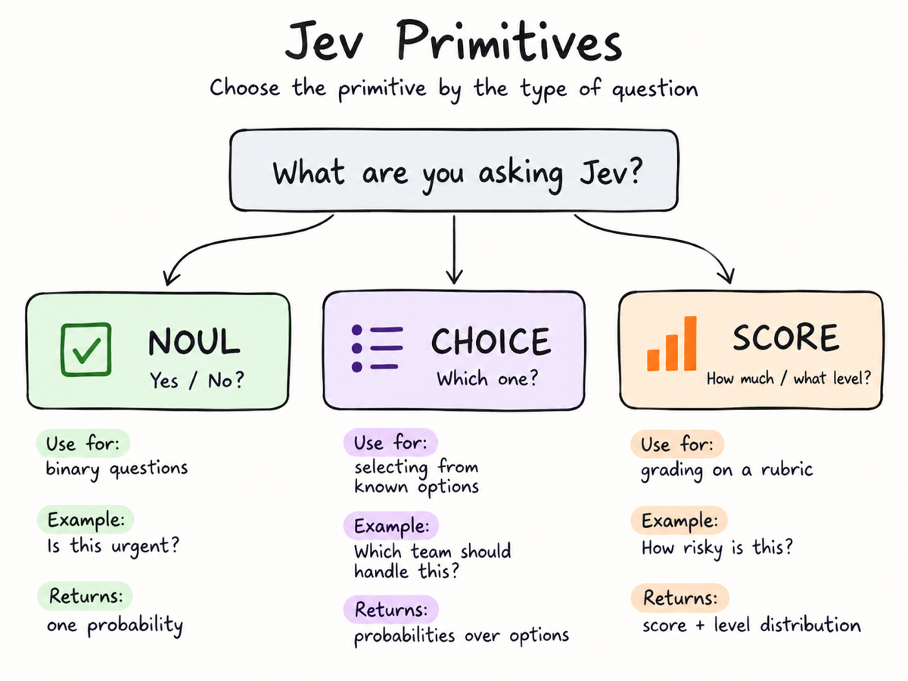

# Jev explicado

**Aprende cómo Jev, de TypeSafe, toma decisiones tipadas y probabilísticas… ejecutándolo.**

Demo en vivo: **https://jev-explained-repo.vercel.app/** (usa tu propia clave de TypeSafe o de Vercel AI Gateway).

<p align="center">
  
</p>

Un playground interactivo que muestra, paso a paso, cómo funciona [Jev](https://typesafe.ai/blog/introducing-system-one-models-and-jev), el modelo System One de TypeSafe.

## Blog explicativo: /blog

La app incluye una página `/blog` (enlazada desde la barra lateral como «📖 Cómo funciona Jev») que explica en detalle qué es Jev, sus tres primitivas y cómo usar sus probabilidades para decidir en tu código.

## ¿Qué es Jev?

Jev no es un LLM conversacional. No genera texto. Le envías un **estado** (cualquier texto o JSON: un correo, una instantánea del mercado, una llamada a herramienta que un agente quiere ejecutar, una bandeja de entrada entera) junto con una o varias **preguntas** tipadas, y devuelve probabilidades calibradas para cada pregunta en un único viaje de ida y vuelta de ~100 ms. Es tu código, no el modelo, quien toma la decisión final aplicando umbrales a esos números.

### Las tres primitivas

Elige la primitiva según el tipo de pregunta que haces:

| Primitiva | Úsala cuando | Ejemplo | Devuelve |
| --- | --- | --- | --- |
| **Noul** — ¿sí / no? | la pregunta es binaria | *¿Es spam este correo?* | una probabilidad, 0 → no, 1 → sí |
| **Choice** — ¿cuál? | eliges entre opciones conocidas | *¿Qué equipo debería encargarse?* | la opción elegida, una probabilidad por opción y una `confidence` |
| **Score** — ¿cuánto / qué nivel? | puntúas con una rúbrica ordenada | *¿Cuánto riesgo tiene esto?* | una puntuación ponderada, una probabilidad por nivel y una `confidence` |

Dos cosas lo diferencian de preguntarle a un LLM:

- **Las preguntas se ejecutan en paralelo.** Jev lee el estado una vez y responde a todas las preguntas a la vez, así que diez preguntas cuestan más o menos lo mismo que una. Puedes lanzar preguntas de forma especulativa y dejar que tu código decida qué importa.
- **La confianza es un segundo eje.** Las respuestas Choice y Score te dicen *qué* (la respuesta) y *con qué seguridad* (la forma de la distribución). Confianza alta → actuar automáticamente; confianza baja → preguntar a una persona.

### Qué muestra este repo

El playground recorre cuatro patrones, cada uno con peticiones reales que puedes ejecutar con tu propia clave:

| Ejemplo | Patrón | Estado | Preguntas |
| --- | --- | --- | --- |
| **Clasificador de spam de correo** | Clasificación de texto | un correo | `is_spam` (noul), `folder` (choice), `suspicion` (score) |
| **NVIDIA: ¿comprar o vender?** | Decisión sobre datos estructurados | una instantánea del mercado en JSON | `action` (choice), `sentiment` (score), `material_risk` (noul) |
| **Guardarraíl de llamadas a herramientas de agentes** | Jev dentro del harness de un agente | una llamada a herramienta que el agente quiere ejecutar | `verdict` (choice), `is_destructive` (noul), `blast_radius` (score), `in_scope` (noul) |
| **Triaje de la bandeja de entrada** | Fan-out especulativo | 8 tickets de soporte | 8 × `priority` (score), `most_urgent` (choice), `needs_incident` (noul) — una sola petición |

En cada ejecución, el panel derecho muestra la petición exacta, la latencia y el consumo de tokens, las respuestas tipadas con barras de probabilidad y la decisión que toma tu código a partir de ellas.

Endpoint: `POST https://api.typesafe.ai/v1/systemone` · Modelo: `jev-latest`. Consulta la [referencia de la API](https://docs.typesafe.ai/api).

## Ejecutarlo

```bash
npm install
npm run dev
```

Abre http://localhost:3000, elige un proveedor, pega su clave, selecciona un ejemplo y pulsa **Ejecutar** (o ⌘↵). Edita el estado o cambia entre los estados de ejemplo para ver cómo varían las respuestas. Usa el conmutador `≡ / </>` para ver el JSON de la petición en bruto.

## Proveedores

Ambos proveedores usan el formato nativo de petición/respuesta de TypeSafe; solo cambian la URL, la clave y el id del modelo.

| Proveedor | Endpoint | Modelo | Clave |
| --- | --- | --- | --- |
| TypeSafe | `https://api.typesafe.ai/v1/systemone` | `jev-latest` | [console.typesafe.ai/keys](https://console.typesafe.ai/keys) |
| Vercel AI Gateway | `https://ai-gateway.vercel.sh/typesafe/v1/systemone` | `typesafe-ai/jev` | Clave API de AI Gateway de tu equipo de Vercel ([documentación](https://vercel.com/docs/ai-gateway/sdks-and-apis/typesafe)) |

## Cómo se gestiona la clave

Ninguna de las dos APIs acepta llamadas de navegador entre orígenes (CORS), así que la app incluye un pequeño proxy en `src/app/api/jev/route.ts`. Las claves se guardan por proveedor únicamente en el `localStorage` de tu navegador y se reenvían en cada petición en la cabecera `x-jev-api-key` (con `x-jev-provider` para seleccionar el destino); el servidor nunca las almacena.

## Estructura del proyecto

```
src/
  app/
    page.tsx            layout de tres paneles + bucle de ejecución
    api/jev/route.ts    proxy en servidor hacia api.typesafe.ai
  components/
    Sidebar.tsx         clave API + lista de ejemplos
    Workbench.tsx       editor de estado, preguntas, conmutador formato/JSON
    TracePanel.tsx      línea temporal de la sesión (petición → respuesta → respuestas → decisión)
    AnswerCard.tsx      renderizadores de noul / choice / score
  lib/
    examples.ts         ejemplos ejecutables
    providers.ts        endpoints e ids de modelo de TypeSafe / Vercel AI Gateway
    types.ts            tipos de la API de TypeSafe
    trace.ts            tipos de eventos de la línea temporal
    useApiKey.ts        hook de proveedor + clave respaldado por localStorage
```

## Añadir un ejemplo

Añade un objeto a `EXAMPLES` en `src/lib/examples.ts`. Cada uno declara un `state`, un mapa `questions` (con la misma forma que acepta la API), unos cuantos `samples` para cambiar rápidamente y una función `decide()` que convierte las respuestas en la decisión que tomaría tu código.

## Contribuir

Los nuevos ejemplos y correcciones son bienvenidos: consulta [CONTRIBUTING.md](CONTRIBUTING.md). Sigue el [Código de conducta](CODE_OF_CONDUCT.md) y notifica los problemas de seguridad como se describe en [SECURITY.md](SECURITY.md).

## Licencia

[MIT](LICENSE) © Daniel Avila
